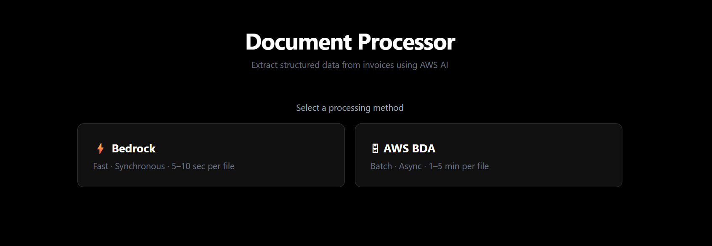
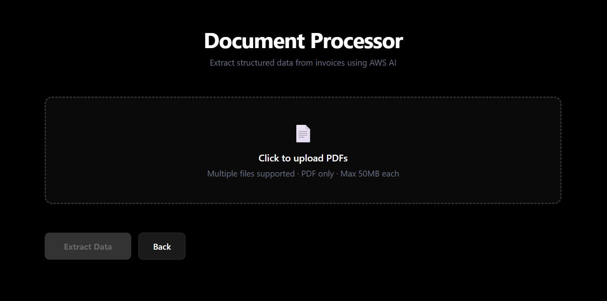
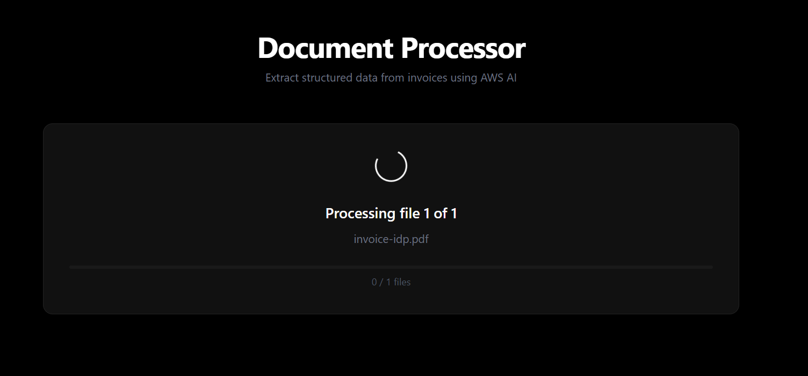

# Document Extractor

Extract structured data from PDF documents using AWS Bedrock or Bedrock Data Automation.

## Features

- **Bedrock** - Fast synchronous processing 
- **BDA** - Asynchronous batch processing
- **Modern Web UI** - Easy-to-use interface with real-time feedback
- **Structured JSON** - Clean output for integration
- **Secure** - Environment-based configuration, no hardcoded secrets

---

## 📊 Extracted Data Schema

### Customizable Output

This application is **generic and flexible**. The data extracted depends on:

- **For Bedrock:** The prompt template you define in `backend_processor.py`
- **For BDA:** The custom blueprint you create in AWS Bedrock Data Automation console

### Example: Invoice Processing

Below is an **example schema** for invoice processing. You can customize this based on your document types:

### Header Fields Example
*These fields are extracted based on the blueprint/prompt configuration*

| Field | Description | Example |
|-------|-------------|---------|
| **documentNumber** | Invoice/PO number | `INV-2024-001` |
| **purchaseOrderNumber** | PO reference | `PO-XYZ-123` |
| **documentDate** | Invoice date | `2024-03-15` |
| **dueDate** | Payment due date | `2024-04-15` |
| **senderName** | Vendor/Supplier name | `ABC Supplies Inc.` |
| **netAmount** | Subtotal before tax | `$1,000.00` |
| **taxAmount** | Tax/VAT amount | `$100.00` |
| **grossAmount** | Total amount due | `$1,100.00` |
| **shippingAmount** | Shipping cost | `$50.00` |
| **currencyCode** | Currency type | `USD` |
| **tariff** | Tariff/Classification | `HS-123456` |
| **freight** | Freight charges | `$25.00` |

### Line Items Example
*Example structure for tabular data within documents*

| Field | Description | Example |
|-------|-------------|---------|
| **description** | Item description | `Office Supplies` |
| **quantity** | Item quantity | `10` |
| **unitPrice** | Price per unit | `$50.00` |
| **netAmount** | Line item total | `$500.00` |
| **materialNumber** | SKU/Material ID | `MAT-001` |
| **unitOfMeasure** | Unit type | `BOX` |

### 🔧 How to Customize

#### For Bedrock:
Edit the `BEDROCK_PROMPT` variable in `backend_processor.py`:
```python
BEDROCK_PROMPT = """
You are an expert document extractor.
Extract the following fields from the document:
- Field 1: Description
- Field 2: Description
- ...

Output ONLY valid JSON matching this schema:
{
  "headerFields": { ... },
  "lineItemFields": [ ... ]
}
"""
```

#### For BDA:
1. Create a custom blueprint in AWS Bedrock Data Automation console
2. Define your extraction schema and rules
3. Add the blueprint ARN to `.env.example`:
```dotenv
BDA_PROJECT_ARN=your_custom_blueprint_arn
BDA_PROFILE_ARN=your_profile_arn
```

> **Note:** The schema shown above is an example for invoice processing. Your actual schema will depend on your document type and extraction requirements.

---

## 🖥️ User Interface

The UI is built with Tailwind CSS and includes:
- Mode selection (Bedrock or BDA)
- PDF upload with validation
- Real-time processing status
- Results display with JSON export

#### Screenshots

<div align="center">

**Mode Selection**


**File Upload**


**Processing**


</div>

Open `document_processor_standalone.html` in your browser to use the UI.

## Requirements

- Python 3.9+
- AWS Account with Bedrock & BDA access
- S3 buckets for input/output
- Valid AWS credentials

## Tech Stack

Python, Flask, AWS Bedrock, TailwindCSS

---

## 🚀 Getting Started

### 1. Clone the Repository

```bash
git clone https://github.com/yourusername/document-extractor.git
cd document-extractor
```

### 2. Create Virtual Environment

```bash
# Windows
python -m venv venv
venv\Scripts\activate

# macOS/Linux
python3 -m venv venv
source venv/bin/activate
```

### 3. Install Dependencies

```bash
pip install -r requirements.txt
```

### 4. Configure Environment

Copy the example configuration and add your AWS credentials:

```bash
# Copy template
cp .env.example .env

# Edit .env with your values
# Add your AWS credentials, S3 buckets, ARNs, etc.
```

**Required Environment Variables:**
```dotenv
AWS_ACCESS_KEY_ID=your_access_key
AWS_SECRET_ACCESS_KEY=your_secret_key
AWS_REGION=ap-south-1
INPUT_BUCKET=my-idp-input-documents
OUTPUT_BUCKET=my-idp-extracted-data
BDA_PROJECT_ARN=arn:aws:bedrock:...
BDA_PROFILE_ARN=arn:aws:bedrock:...
```

### 5. Run the Backend

```bash
python backend_processor.py
```

The Flask server will start at `http://localhost:5000`

### 6. Open the UI

Open `document_processor_standalone.html` in your browser or serve it through a web server:

```bash
# Using Python
python -m http.server 8000

# Then open: http://localhost:8000/document_processor_standalone.html
```

---

## API

**POST** `/api/process-documents`

Parameters:
- `files` - PDF file(s) to process
- `mode` - `bedrock` or `bda`

Example:
```bash
curl -X POST http://localhost:5000/api/process-documents \
  -F "files=@document.pdf" \
  -F "mode=bedrock"
```

**GET** `/api/health` - Health check endpoint

## Project Structure

```
document-extractor/
├── backend_processor.py          # Flask backend & processing logic
├── document_processor_standalone.html  # Web UI
├── requirements.txt              # Python dependencies
├── .env.example                  # Environment template
├── .gitignore                    # Git ignore rules
└── README.md                     # This file
```

---

## 🔐 Security

- ✅ No hardcoded secrets - all credentials in `.env`
- ✅ `.env` is git-ignored (won't be committed)
- ✅ `.env.example` provided as template
- ✅ CORS configured for trusted origins only
- ✅ File type validation (PDF only)
- ✅ File size limits (50MB max)

---

## Troubleshooting

**AWS Credentials Error:** Add valid credentials to `.env` file

**S3 Access Denied:** Verify bucket names and IAM permissions

**ClientToken Error:** Ensure token follows AWS pattern (alphanumeric with hyphens)

**Processing Timeout:** Check document format and increase `BDA_TIMEOUT_SECONDS` in `.env`

## 🤝 Contributing

Contributions welcome! Fork, create a feature branch, and submit a pull request.

## License

MIT License
